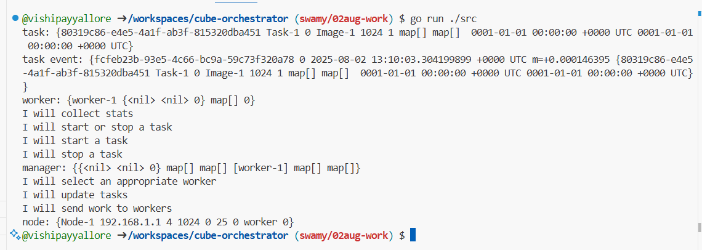
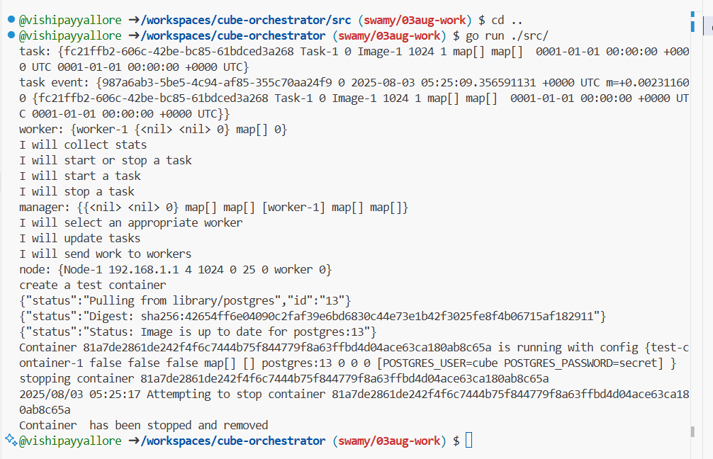

# Cube Orchestrator

🛠️ Learning to build an orchestrator in Go by following the book `Build an Orchestrator in Go (From Scratch)` from Manning Publications. Exploring concepts like process management, containers, and scheduling from the ground up.

## Project Structure

```text
cube-orchestrator/
├── .copilot/           # GitHub Copilot configuration
│   └── settings.json   # Copilot settings for the project
├── .github/            # GitHub configuration
│   └── copilot-instructions.md # Copilot context and guidelines
├── docs/               # Comprehensive documentation suite
│   ├── images/         # Documentation images and diagrams
│   ├── api-architecture.md     # API design patterns and structure
│   ├── build-system.md         # Build system documentation
│   ├── docker-commands.md      # Docker commands reference
│   ├── go-project-layout.md    # Go project structure guidelines
│   ├── pkg-directory-plan.md   # Future API package planning
│   ├── postgresql-primer.md    # PostgreSQL guide
│   ├── project-overview.md     # High-level project overview
│   ├── project-structure.md    # Detailed structure documentation
│   └── troubleshooting.md      # Common issues and solutions
├── scripts/            # Build and utility scripts
│   ├── build.sh        # Professional build script with timestamping
│   └── cleanup-builds.sh # Build artifact cleanup utility
├── src/                # Source code directory
│   └── orchestrator/   # Main orchestrator application
│       ├── cmd/main.go # Main application with orchestrator demo
│       ├── internal/   # Private application packages
│       │   ├── docker/     # Docker client abstraction
│       │   ├── manager/    # Orchestrator manager component
│       │   ├── worker/     # Worker node implementation
│       │   ├── node/       # Node abstraction and resources
│       │   ├── scheduler/  # Task scheduling algorithms
│       │   └── task/       # Task definitions and state machine
│       ├── pkg/        # Public API packages (planned)
│       ├── go.mod      # Go module definition
│       └── go.sum      # Dependency checksums
├── LICENSE             # Project license
└── README.md           # Project documentation
```

## Getting third-party dependencies

To manage third-party dependencies, use the Go module system. Run the following commands in the project root:

```bash
# Clean module cache and tidy dependencies
go clean -modcache
go mod tidy

# Core dependencies for the orchestrator (currently installed)
go get github.com/golang-collections/collections/queue
go get github.com/google/uuid
go get github.com/docker/go-connections/nat
```

### Additional Dependencies (for future chapters)

These dependencies will be needed as you progress through the book chapters:

```bash
# HTTP routing and API development
go get github.com/gorilla/mux

# System monitoring and resource management
go get github.com/shirou/gopsutil/v3/cpu
go get github.com/shirou/gopsutil/v3/mem

# Structured logging
go get github.com/sirupsen/logrus
```

### Docker Client Dependencies (Troubleshooting)

**Security Update**: This project now uses Docker v28.3.3+incompatible to address security vulnerabilities:

- ✅ **Fixed GO-2023-1699**: Docker Swarm encrypted overlay network authentication issue
- ✅ **Fixed GO-2023-1700**: Docker Swarm encrypted overlay network encryption issue  
- ✅ **Fixed GO-2023-1701**: Docker Swarm single endpoint authentication issue

**Note**: If you encounter API compatibility issues with newer Docker versions, the codebase has been updated to use the v28 API structure.

**Solutions for older versions**:

1. **Recommended**: Use Docker v28.3.3+incompatible (current implementation)
2. **Alternative approach**: Use the Moby client directly:

   ```bash
   go get github.com/moby/moby/client
   ```

3. **Wait for book updates**: The book may provide updated import instructions

## Getting Started

### Running the Application

To run the cube orchestrator demo:

```bash
cd src/orchestrator
go run ./cmd/main.go
```



### Docker Container Integration (Chapter 3)

The application now includes Docker container management capabilities:



### Docker Setup

For Docker commands and container management instructions, see [Docker Commands](docs/docker-commands.md).

### Troubleshooting

If you encounter any issues with dependencies, imports, or compilation, see the [Troubleshooting Guide](docs/troubleshooting.md).

## Development

### Docs quality checks (local)

Run Markdown lint against README and all docs before opening a PR:

```powershell
# From repo root
npx --yes markdownlint-cli2 "README.md" "docs/**/*.md"
```

This uses the repository's .markdownlint.json automatically.
